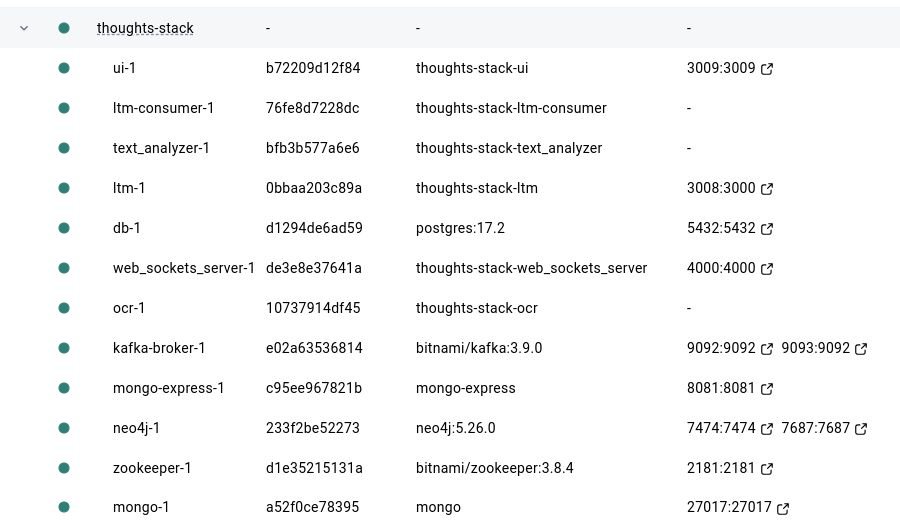

Start app in Kubernetes (app images local only):
```
kubectl apply -f k8s_manifests/namespace.yaml
kubectl apply -f k8s_manifests/
```


Start app in Docker:
```
docker compose up --build
```



<hr/>
<br/>


